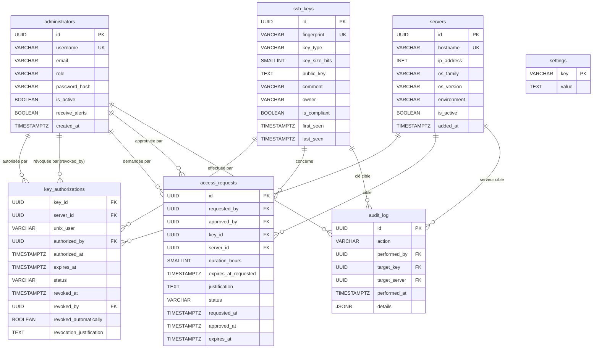

# Diagramme ERD — ssh-access-manager



## Description des relations

| Relation | Cardinalité | Description |
|---|---|---|
| `ssh_keys` → `key_authorizations` | 1:N | Une clé peut être autorisée sur plusieurs serveurs/utilisateurs |
| `servers` → `key_authorizations` | 1:N | Un serveur peut héberger plusieurs clés autorisées |
| `administrators` → `key_authorizations` | 1:N | Un admin autorise / révoque des accès |
| `administrators` → `access_requests` | 1:N | Un admin fait ou approuve des demandes |
| `ssh_keys` → `access_requests` | 1:N | Une clé peut faire l'objet de plusieurs demandes |
| `servers` → `access_requests` | 1:N | Un serveur cible plusieurs demandes |
| `administrators` → `audit_log` | 1:N | Un admin génère des entrées d'audit |
| `ssh_keys` → `audit_log` | 1:N | Une clé est référencée dans l'audit |
| `servers` → `audit_log` | 1:N | Un serveur est référencé dans l'audit |

## Clé primaire composite — key_authorizations

`key_authorizations` a une PK composite sur trois colonnes : `(key_id, server_id, unix_user)`.
Cela permet à une même clé SSH d'être déployée pour plusieurs utilisateurs Unix sur le même serveur.

## Colonne générée — ssh_keys.is_compliant

`ssh_keys.is_compliant` est une colonne `GENERATED ALWAYS AS … STORED` :

```sql
is_compliant BOOLEAN GENERATED ALWAYS AS (
    key_type = 'ssh-ed25519' OR
    (key_type = 'ssh-rsa' AND key_size_bits >= 4096)
) STORED
```

Valeur calculée automatiquement par PostgreSQL à chaque INSERT/UPDATE — jamais écrite par l'application.

## Champ owner — texte libre

`ssh_keys.owner` est un `VARCHAR(255)` libre (pas une FK vers `administrators`).
Il peut désigner un non-administrateur (ex : développeur externe) et reste NULL si inconnu.

## Table settings

Stocke la configuration dynamique du système. Modifiable via `PUT /api/system/config`
ou l'UI Settings sans redémarrage du container.

Clés présentes par défaut :

| Clé | Valeur par défaut | Description |
|-----|-------------------|-------------|
| `scan_interval_hours` | `4` | Intervalle entre deux scans SSH |
| `expire_warn_days` | `7` | Premier avertissement avant expiration (jours) |
| `expire_warn_days_2` | `2` | Second avertissement avant expiration (jours) |

## Colonne receive_alerts — administrators

`administrators.receive_alerts` contrôle si un administrateur reçoit les emails d'alerte.
Modifiable par un sysadmin via `PUT /api/admins/<username>/alerts` ou le toggle dans l'UI Admins.
